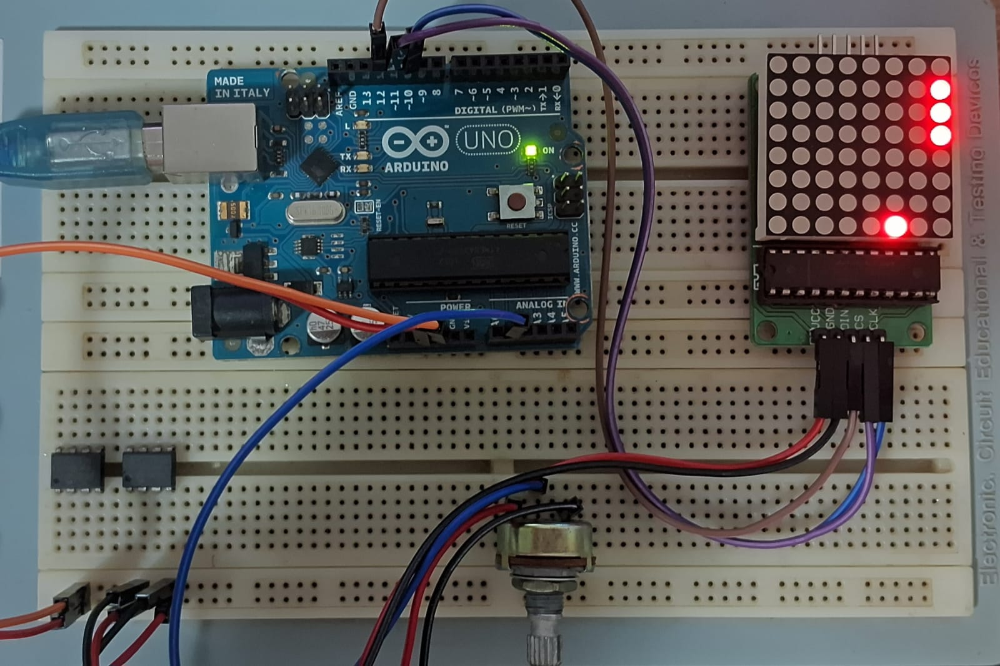
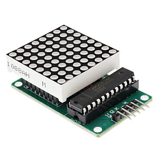
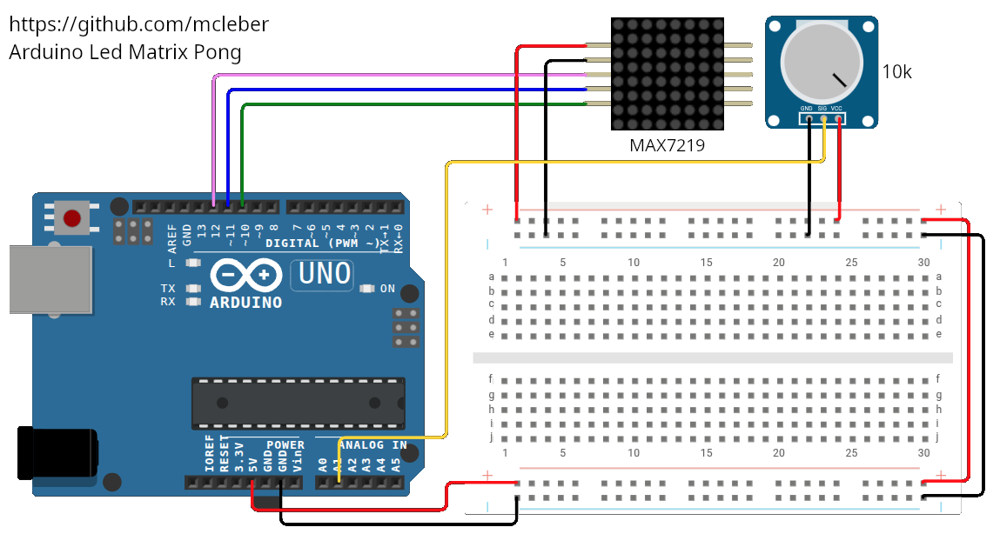

# 🎮 Arduino LED Matrix Pong  
### A Minimal Embedded Arcade Game using MAX7219


<!--  -->
<p align="center">
  
</p>

---

## 📖 Overview

This project revisits a minimalist **Pong-style arcade game** built with an Arduino Uno and an 8×8 LED matrix driven by the MAX7219.

Originally developed as an early learning exercise, it has now been refactored with improved structure, cleaner organization, enhanced readability, and a redesigned game-over animation.

The paddle is controlled via a potentiometer, while the ball physics are implemented using discrete position updates combined with deterministic collision detection logic.

Beyond being a compact arcade implementation, the project demonstrates several core embedded systems concepts:

- Analog-to-Digital Conversion (ADC) for real-time input acquisition  
- Deterministic control logic for interactive systems  
- Collision detection in constrained environments  
- SPI-based communication with the MAX7219 LED driver  
- Dynamic difficulty adjustment through timing control  

---

## 🧰 Hardware Required

### Electronics
- 1 × Arduino Uno
- 1 × 8x8 LED Matrix with MAX7219 driver
- 1 × 10 kΩ potentiometer

### Miscellaneous
- Jumper wires
- Breadboard

---

## 📷 Hardware Setup

### LED Matrix Module
<p align="center">
  
</p>
<!--  -->

The MAX7219 simplifies LED matrix control by handling multiplexing internally and communicating through a SPI-like interface.

### Wiring Diagram
<p align="center">
  
</p>
<!--  -->

---

## 🔌 Wiring

### MAX7219 Connections

| MAX7219 | Arduino |
|----------|----------|
| VCC      | 5V       |
| GND      | GND      |
| DIN      | D12      |
| CS       | D11      |
| CLK      | D10      |

### Potentiometer

| Pin | Connection |
|------|------------|
| Left | GND |
| Right | 5V |
| Middle | A1 |

---

## 🧠 How It Works

The game logic follows a structured embedded architecture:

1. Read paddle position using ADC
2. Update ball position based on direction vector
3. Detect collisions (walls and paddle)
4. Render updated frame
5. Adjust difficulty by increasing ball speed
6. Trigger animation when game over

---

## 🎮 Features

- Modular firmware architecture
- Increasing difficulty over time
- Game-over animation
- Clean and optimized rendering logic
- Lightweight and hardware-efficient

---

## 📂 Project Structure

```text
Arduino-Led-Matrix-Pong/
│
├── images/
│   ├── driver_max7219.jpg
|   ├── game_running.jpeg
│   └── schematic.jpg
|
├── library/
│   └── ledControl
|
├── src/
│   └── pong.ino
│
└── README.md
```

---

## 🚀 Future Improvements

- Score system
- Non-blocking timing using millis()
- Sound feedback (buzzer)
- Two-player mode
- Angle variation based on paddle impact

---

## 📜 License

This project is open-source and available under the MIT License.

---

## 👨‍💻 Author

Developed as an embedded systems game project.
